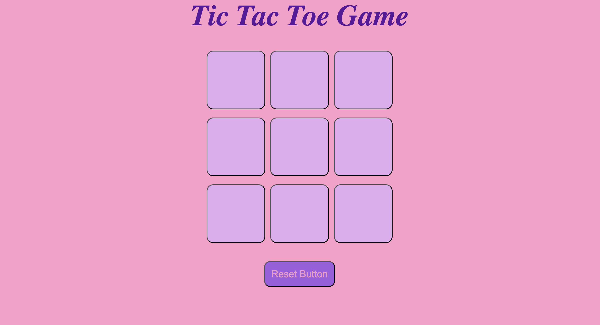

# Tic Tac Toe Game

I built this simple Tic Tac Toe game following a tutorial with help from Shradha Khapra.

It's a small, friendly project — open `index.html` in your browser (or use your editor's Live Server) to play.

How to use
- Click any empty square to place O or X (turns alternate).
- When someone wins or the board fills with no winner, a message appears and you can start a new game.
- Use the Reset button or the New Game button in the message to clear the board.

Screenshot

